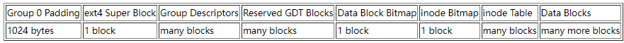
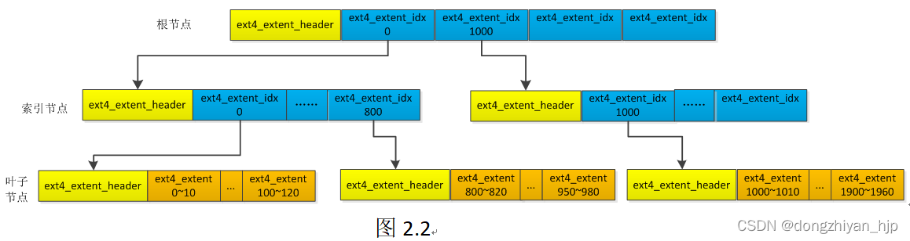

# Rust 实现 Ext4 文件系统与模型检测

## Rust Ext4 文件系统

使用 Rust 实现了具有部分功能的 [Ext4 文件系统](https://github.com/LJxTHUCS/ext4_rs)，支持的主要功能如下：

| 功能         | 介绍                                                         |
| ------------ | ------------------------------------------------------------ |
| 文件操作     | read、write 等基本文件创建和读写接口。                       |
| 目录操作     | mkdir、rmdir、list 等目录创建、删除、遍历接口，支持递归查询。 |
| 属性操作     | setattr、getattr 等属性设置接口。                            |
| 附加属性操作 | setxattr、getxattr、removexattr 等额外属性的增、删、查接口。 |
| 硬链接       | link、unlink 等硬链接创建和删除接口。                        |
| 重命名       | rename 文件和目录的重命名接口。                              |

未实现的功能：符号链接、日志等。

该项目最初以 [@yuoo655 的 ext4_rs](https://github.com/yuoo655/ext4_rs) 为基础，进行了大量颠覆性的重构，并进一步实现了更多功能。此外，该文件系统已接入 Metis 模型检测框架进行测试，具体如后文所述。

> [Ext4 文件系统标准文档](https://ext4.wiki.kernel.org/index.php/Ext4_Disk_Layout#Blocks)

### 架构设计

Ext4 文件系统 ext4_rs 封装为了一个 Rust Crate 以供操作系统使用，并提供了主要的通用性接口以对接不同操作系统的虚拟文件系统接口。ext4_rs 主要由块设备、磁盘布局和重要结构、核心操作、对外接口四部分组成。

#### 块设备

ext4_rs 文件系统中数据存储的单位为块，块的标准大小为 4096 字节。

```rust
/// Common data block descriptor
pub struct Block {
    /// Physical block id
    pub id: PBlockId,
    /// Raw block data
    pub data: [u8; BLOCK_SIZE],
}
```

定义 `trait BlockDevice` 作为通用的块读写设备的接口以兼容不同的底层实现。

```rust
/// Common interface for block devices
pub trait BlockDevice: Send + Sync + Any + Debug {
    /// Read a block from disk
    fn read_block(&self, block_id: PBlockId) -> Block;
    /// Write a block to disk
    fn write_block(&self, block: &Block);
}
```

#### 磁盘布局与重要结构

Ext4 文件系统的标准磁盘布局如下图所示。



Super Block、Block Group Descriptor、Inode、DirEntry 等重要的结构在 `ext4_defs` 中定义。

索引节点 Inode 为 Ext4 文件系统的核心结构，其提供了主要的文件定位和管理功能。在 Ext4 文件系统中，索引节点使用 Extent Tree 将上层对于逻辑数据块的访问定位到相应的物理数据块。Extent 树的典型组织形式如下。



Extent Tree 中的重要结构定义在 `ext4_defs::extent.rs` 中。

#### 核心操作

定义 `struct Ext4` 作为 Ext4 文件系统的核心结构如下。

```rust
pub struct Ext4 {
    block_device: Arc<dyn BlockDevice>,
}
```

`Ext4` 实现了 Ext4 文件系统的核心功能，按照类型共分为：

* 磁盘读写：重要结构如 SuperBlock、Inode、BlockGroupDesc 等的磁盘读写等功能。
* 资源分配：索引节点和数据块的分配和回收，索引节点位图和数据块位图的管理等功能。
* 目录操作：目录项的插入、删除，目录的遍历等功能。
* 链接操作：索引节点链接的创建和删除等功能。
* Extent 树操作：索引节点 Extent 树的查询、插入、删除等功能。

#### 对外接口

`Ext4` 对外提供 low level 和 high level 两套接口。

* low level 接口：参照 libfuse 中 `struct fuse_lowlevel_ops` 为 Ext4 设计并实现了一套 low level 的接口。这一套接口以索引节点为主要操作对象，只进行一层目录查询。这套接口具有较高的通用性，同时由于参照了 libfuse 进行设计，也非常利于与 FUSE 库对接。

  主要包括：getattr、setattr、create、read、write、link、unlink、rename、mkdir、lookup、list、rmdir、getxattr、setxattr、removexattr。

* high level 接口：以路径为主要操作对象，并支持查询。这套接口封装程度较高，通用性有限。


## [Metis](https://www.usenix.org/conference/fast24/presentation/liu-yifei  ) 模型检测框架

Metis 是一个基于 SPIN 的文件系统测试框架。Metis 以文件系统状态为核心，分别对待测的文件系统和用于参照的标准文件系统 [RefFS](https://github.com/sbu-fsl/RefFS) 进行相同的操作，通过比较两个文件系统行为的差异来发现待测文件系统的 bug。

>  [Metis 和 SPIN 的原理介绍](./reports/week7/Metis-Spin.md)
>
>  [RefFS 的原理介绍](./reports/week8/RefFS.md)


## Rust Ext4 接入 Metis 

为了使用 Metis 测试 Rust 实现的 Ext4 文件系统，需要分析 Metis 对参与测试的文件系统的要求（[一些尝试和可行方案分析](./reports/week8/Metis-custom-test.md)）。最终选择的方案是参照 RefFS，使用 FUSE （Filesystem in USEr space）将 Rust Ext4 接入 Metis，具体方案如下：

* 采用一块内存空间用于 Rust Ext4 的模拟磁盘，并支持磁盘状态的保存和恢复。
* 对 Rust Ext4 文件系统的底层接口进行包装，实现主要的 FUSE 接口。
* 仿照 RefFS 设计特殊的文件系统调用（ioctl），在收到相应调用时自行进行状态保存或恢复。
* 修改 Metis 测试脚本，对于 Ext4 FUSE Fs 进行特殊处理。
* 修改 Metis 中状态切换前后的 hook 函数（[hook 参考](./reports/week7/Metis-Spin.md)）以进行状态相关的文件系统调用。

### 支持状态操作的内存模拟磁盘

为了更泛化地表示任意支持状态操作的块设备，在 `ext4_rs::BlockDevice` 基础上定义 `trait StateBlockDevice` 如下。

``` rust
/// A block device supporting state save and restore
pub trait StateBlockDevice<T>: BlockDevice
where
    T: Sized,
{
    fn checkpoint(&self) -> T;
    fn restore(&self, state: T);
}
```

其中泛型 `T` 表示任意可作为设备状态的具体类型。`checkpoint` 和 `restore` 分别为状态的保存和恢复函数。

定义 `BlockMem`，采用一块内存空间作为 Ext4 文件系统的模拟磁盘。

```rust
/// An in-memory block device
pub struct BlockMem(Mutex<Vec<[u8; BLOCK_SIZE]>>);

impl BlockMem {
    /// Create a new block device with the given number of blocks
    pub fn new(num_blocks: u64) -> Self {
        let mut blocks = Vec::with_capacity(num_blocks as usize);
        for _ in 0..num_blocks {
            blocks.push([0; BLOCK_SIZE]);
        }
        Self(Mutex::new(blocks))
    }
}
```

由于目前尚未实现 Rust Ext4 的 mkfs 工具，因此采用 Linux 系统的 mkfs.ext4 工具进行 `BlockMem` 的初始化。

```rust
impl BlockMem {
	/// Make an ext4 filesystem on the block device
    pub fn mkfs(&self) {
        let path = "tmp.img";
        let mut mem = self.0.lock().unwrap();
        // Create a temp block file
        std::process::Command::new("dd")
            .args([
                "if=/dev/zero",
                &format!("of={}", path),
                &format!("bs={}", BLOCK_SIZE),
                &format!("count={}", mem.len()),
            ])
            .status()
            .expect("Failed to create temp file");
        // Make ext4 fs
        std::process::Command::new("mkfs.ext4")
            // Enable 64-bit feature and use 256-bit inode size
            .args([path, &format!("-b {}", BLOCK_SIZE), "-O 64bit", "-I 256"])
            .status()
            .expect("Failed to make ext4 fs");
        // Open the temp file and copy data to memory
        let mut file = OpenOptions::new().read(true).open(path).unwrap();
        for block in mem.iter_mut() {
            file.read(block).expect("Read failed");
        }
        // Remove the temp file
        std::process::Command::new("rm")
            .args(["-rf", path])
            .status()
            .expect("Failed to remove temp file");
    }
}
```

注意其中在调用 mkfs.ext4 命令时启用了 64bit 功能，并采用 256 字节的索引节点，以适应目前 `ext4_rs::BlockGroupDesc` 和 `ext4_rs::Inode` 的实现。

为 `BlockMem` 实现 `BlockDevice` 和 `StateBlockDevice` 如下，其中 `BlockMem` 的具体状态类型采用 `Vec<[u8; BLOCK_SIZE]>`。

```rust
impl BlockDevice for BlockMem {
    fn read_block(&self, block_id: u64) -> Block {
        Block {
            id: block_id,
            data: self.0.lock().unwrap()[block_id as usize],
        }
    }
    fn write_block(&self, block: &Block) {
        self.0.lock().unwrap()[block.id as usize] = block.data;
    }
}

impl StateBlockDevice<Vec<[u8; BLOCK_SIZE]>> for BlockMem {
    fn checkpoint(&self) -> Vec<[u8; BLOCK_SIZE]> {
        self.0.lock().unwrap().clone()
    }
    fn restore(&self, state: Vec<[u8; BLOCK_SIZE]>) {
        self.0.lock().unwrap().clone_from(&state);
    }
}
```

至此，实现了内存模拟的文件系统磁盘，并支持磁盘状态的保存和恢复。

### 支持状态操作的 Ext4 FUSE 文件系统

使用常用的 Rust FUSE 库 [fuser](https://docs.rs/fuser/latest/fuser/index.html)，其核心是实现 `trait fuser::Filesystem`。

> ```rust
> pub trait Filesystem {...}
> ```
>
> Filesystem trait.
>
> This trait must be implemented to provide a userspace filesystem via FUSE. These methods correspond to fuse_lowlevel_ops in libfuse. Reasonable default implementations are provided here to get a mountable filesystem that does nothing.

定义 `StateExt4FuseFs`，对 `ext4_rs::Ext4` 进行封装，实现 FUSE 接口，并额外支持状态操作。

```rust
pub struct StateExt4FuseFs<T> {
    /// Block device
    block_dev: Arc<dyn StateBlockDevice<T>>,
    /// Ext4 filesystem
    fs: Ext4,
    /// Checkpoint states
    states: HashMap<StateKey, T>,
    /// Next file handler id
    next_fid: FId,
    /// Next directory handler id
    next_did: FId,
}
```

`StateExt4FuseFs` 使用了 `StateBlockDevice`，故支持状态保存和恢复操作。文件系统状态保存在哈希表 `states` 中，相应的操作实现如下。

```rust
impl<T: 'static> StateExt4FuseFs<T> {
	/// Save a state
    fn checkpoint(&mut self, key: StateKey) -> bool {
        log::info!("Checkpoint {}", key);
        self.states
            .insert(key, self.block_dev.checkpoint())
            .is_none()
    }

    /// Restore a state
    fn restore(&mut self, key: StateKey) -> bool {
        log::info!("Restore {}", key);
        if let Some(state) = self.states.remove(&key) {
            self.block_dev.restore(state);
            true
        } else {
            false
        }
    }
}
```

为 `StateExt4FuseFs` 实现 `trait Filesystem`。上文所述 low_level 的接口基本对照 `Filesystem` 中的接口设计，因此这里并不涉及具体逻辑的实现，主要是进行对应 low_level 接口的封装以及错误处理。

```rust
impl<T: 'static> Filesystem for StateExt4FuseFs<T> {
	/* ... */
}
```

仿照 RefFS，`StateExt4FuseFs` 同样采用 `ioctl` 作为 Metis 控制文件系统状态操作的系统调用，实现如下。

```rust
impl<T: 'static> Filesystem for StateExt4FuseFs<T> { 
	fn ioctl(
        &mut self,
        _req: &Request<'_>,
        _ino: u64,
        _fh: u64,
        _flags: u32,
        cmd: u32,
        in_data: &[u8],
        _out_size: u32,
        reply: fuser::ReplyIoctl,
    ) {
        match cmd {
            Self::CHECKPOINT_IOC => {
                let key = StateKey::from_ne_bytes(in_data[0..8].try_into().unwrap());
                if self.checkpoint(key) {
                    reply.ioctl(0, in_data);
                } else {
                    reply.error(-1);
                }
            }
            Self::RESTORE_IOC => {
                let key = StateKey::from_ne_bytes(in_data[0..8].try_into().unwrap());
                if self.restore(key) {
                    reply.ioctl(0, in_data);
                } else {
                    reply.error(-1);
                }
            }
            _ => {
                log::error!("Unknown ioctl command: {}", cmd);
                reply.error(ErrCode::ENOTSUP as i32);
            }
        }
    }
}
```

将 `BlockMem` 作为模拟磁盘创建 `StateExt4FuseFs` 实例。实现了 `trait Filesystem` 的文件系统即可使用 `fuser::mount2` 函数挂载到 Linux 文件系统，并启动 FUSE 进程。

```rust
fn main() {
    /* ... */
    // Initialize block device and filesystem
    let block_mem = Arc::new(BlockMem::new(args.block));
    block_mem.mkfs();
    let fs = StateExt4FuseFs::new(block_mem);

    // Mount fs and enter session loop
    let options = Vec::<MountOption>::new();
    info!("Mount ext4fs to \"{}\"", args.mountpoint);
    let res = fuser::mount2(fs, &args.mountpoint, &options);
    if let Err(e) = res {
        error!("Error occured: {:?}", e);
    }
}
```

至此，实现了 Ext4 FUSE 文件系统，并提供了 `ioctl` 调用用于 Metis 控制文件系统内部的状态管理。

### 将 Ext4 FUSE 文件系统接入 Metis

为将 Ext4 FUSE 文件系统接入 Metis，需要修改 Metis 的测试逻辑以进行特殊处理。

* 准备阶段：需要对 Ext4 FUSE 文件系统进行注册，并指定相应的设备类型和大小。由于我们的 Ext4 FUSE 文件系统采用全内存的模拟磁盘，因此仿照 RefFS 将设备类型设为空。

* 启动阶段：需调用 Ext4 FUSE 文件系统的可执行文件，将文件系统挂载到目标位置，启动 FUSE 进程对目标位置的文件系统操作进行监听。为此，需要修改 `fs-state/setup.c`，新实现 `setup_fuse_fs` 函数。

  ```c 
  // Set up FUSE filesystem
  static int setup_fuse_fs(const char *devname, const char *basepath, const size_t size_kb)
  {
      // Mount FUSE
      const char *mountpoint = basepath;
      char cmdbuf[PATH_MAX];
      // CUSTOM FUSE: Use custom command to run and mount FUSE fs
      snprintf(cmdbuf, PATH_MAX, "%s -m %s", FUSE_FS_PATH, mountpoint);
      
      pid_t pid = fork();
      if (pid == 0)
      {   
          freopen("fuse.log", "w", stdout);
          execute_cmd(cmdbuf);
          exit(0);
      }
      sleep(2);
      if (!is_mounted(mountpoint))
      {
          fprintf(stderr, "Cannot mount %s , did not setup in time.\n", mountpoint);
          return -4;
      }
      return 0;
  }
  ```

* 各测试步阶段：需要修改状态切换前后的 hook 函数，对 Ext4 FUSE 文件系统进行 ioctl 调用，以完成文件系统状态的内部切换。为此，需要修改 `fs-state/fileutil.c`，实现相应的函数。

  ```c
  static int checkpoint_fuse_fs(size_t key, const char *mp)
  {
      int mpfd = open(mp, O_RDONLY | __O_DIRECTORY);
      if (mpfd < 0) {
          logerr("Cannot open mountpoint %s", mp);
          return errno;
      }
      int ret = ioctl(mpfd, FUSE_FS_CHECKPOINT, key);
      if (ret < 0) {
          logerr("Cannot perform checkpoint at %s", mp);
          ret = errno;
      }
      close(mpfd);
      return ret;
  }
  
  static int restore_fuse_fs(size_t key, const char *mp)
  {
      int mpfd = open(mp, O_RDONLY | __O_DIRECTORY);
      if (mpfd < 0) {
          logerr("Cannot open mountpoint %s", mp);
          return errno;
      }
      int ret = ioctl(mpfd, FUSE_FS_RESTORE, key);
      if (ret < 0) {
          logerr("Cannot perform restore at %s with key %zu", mp, key);
          ret = errno;
      }
      close(mpfd);
      return ret;
  }
  ```

至此，可以将 RefFS 作为参照，使用 Metis 测试 Rust Ext4 文件系统。


## Metis 测试结果

使用 Metis 测试 Rust Ext4 文件系统，发现以下 bug，并进行了相应的修复。

| Metis 测试的表现                                             | Bug 的原因                                                   | 修复状态                                             |
| :----------------------------------------------------------- | :----------------------------------------------------------- | :--------------------------------------------------- |
| 索引节点 Inode 的 uid 出现奇怪的错误值。                     | 由于文件系统创建时部分 feature 设置不当，导致 SuperBlock 中记录的 Inode 大小小于实际使用的 Inode 大小，导致非法访问。 | 在创建文件系统时指定了索引节点的大小为 256，已修复。 |
| 索引节点的附加属性 xattr 删除时出现越界访问 panic。          | 删除 xattr 时需要移动 xattr 表中目标记录之后的所有记录，实现时记录的偏移位置设置不当，导致越界访问。 | 修改了 xattr 的删除逻辑，已修复。                    |
| 文件读取时访问到未分配的数据块，extent 树出现查询失败的情况。 | 在使用 setattr 设置索引节点属性时允许设置 size，当 size 增大时可能需要为索引节点继续分配数据块。原始实现忽略了可能的数据块分配，导致后续访问到未分配的数据块。 | 在 setattr 时进行可能的数据块分配，已修复。          |
| rename 操作后出现 link count 错误。                          | rename 操作需要首先从原位置 unlink 子节点，再 link 到新位置。当过程中涉及目录时，需要考虑 ".." 等特殊目录项引起的 link count 更新。 | 重新修改了 link、unlink 和 remove 的逻辑，已修复。   |
| rename 操作调用返回值不一致。                                | rename 操作允许将一个目录覆盖到另一个空目录的位置，原始实现忽略了这种情况。 | 对这种情况进行了特判，已修复。                       |
| 分配新节点时，出现 substract with overflow panic 。          | 分配新节点时，Block Group 和 SuperBlock 中的计数器更新错误，导致减越界。 | 已修复。                                             |
| 根目录的 link count 错误。                                   | 原因未知。自行测试时使用 stat 命令看到根目录的 link count 均正常，检查代码也未见异常。 | 未修复。                                             |

当忽略上述 “根目录的 link count 错误” 后，Rust Ext4 文件系统能够与 RefFS 持续进行约 15 万个文件系统操作而不出现不一致的情况。


