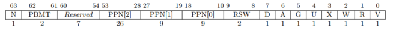

# LAB 2 实验报告

## 功能总结

### 重写 sys_get_time 和 sys_task_info

对于 `struct TimeVal` 以及 `struct TaskInfo`，取出其中各个字段的虚拟地址，分别翻译为相应的物理地址，再向其中写入。

### mmap 和 munmap

在 `MemorySet` 中新增一个 `mmapped_frames` 字段用于维护使用 `sys_mmap` 映射的物理页帧。

* 对于单页 `mmap`，若目标虚拟地址已被映射，则报错；否则分配一个新的物理页帧，插入页表，并更新 `mmapped_frames` 。
* 对于单页 `munmap`，若目标虚拟地址未被映射，则报错；否则将该虚拟地址从页表中删除，并将对应的物理页帧 从`mmapped_frames` 中删除。

多页的 `mmap`和 `munmap` 只需多次进行单页操作即可。

## 问答作业

1. 请列举 SV39 页表页表项的组成，描述其中的标志位有何作用？

   

   V：该页表项是否有效。

   R：该页是否可读。

   W：该页是否可写。

   X：该页是否可执行。

   U：用户态是否可访问该页。

   G：该页是否为全局映射（是否在所有地址空间中被映射）。

   A：自上次 A 标志位被重置后，该页是否被访问（读、写、执行）过。

   D：自上次 D 标志位被重置后，该页是否被写入过。

2. 缺页指的是进程访问页面时页面不在页表中或在页表中无效的现象，此时 MMU 将会返回一个中断， 告知 os 进程内存访问出了问题。os 选择填补页表并重新执行异常指令或者杀死进程。

   - 请问哪些异常可能是缺页导致的？

     Load page fault, Store page fault, Instruction page fault

   - 发生缺页时，描述相关重要寄存器的值，上次实验描述过的可以简略。

     `scause`：Load page fault 或 Store page fault 或 Instruction page fault。

     `stval`：发生缺页时访问的虚拟地址。

     `sepc`：发生缺页时执行的指令。

   缺页有两个常见的原因，其一是 Lazy 策略，也就是直到内存页面被访问才实际进行页表操作。 比如，一个程序被执行时，进程的代码段理论上需要从磁盘加载到内存。但是 os 并不会马上这样做， 而是会保存 .text 段在磁盘的位置信息，在这些代码第一次被执行时才完成从磁盘的加载操作。

   - 这样做有哪些好处？

     避免进行不必要的页表操作。如果该程序的代码只执行了一部分便退出了，可以防止无用地加载其他未执行的代码。还可以减少程序启动时的操作，从而使程序更快地开始运行。

   其实，我们的 mmap 也可以采取 Lazy 策略，比如：一个用户进程先后申请了 10G 的内存空间， 然后用了其中 1M 就直接退出了。按照现在的做法，我们显然亏大了，进行了很多没有意义的页表操作。

   - 处理 10G 连续的内存页面，对应的 SV39 页表大致占用多少内存 (估算数量级即可)？

     每个物理页面大小为 $4$ KB，$10$ G 共 $10\times 2^{18}$ 页，每个三级页表节点有 $512$ 个页表项，因此共需要 $10 \times 2^9$ 个三级页表节点 ，每个二级页表节点指向 $512$ 个三级页表节点，因此共需要 $10$ 个二级页表节点。故页表占用的内存大致为 $5130 \times 4$ KB 约 $20$ MB。

   - 请简单思考如何才能实现 Lazy 策略，缺页时又如何处理？描述合理即可，不需要考虑实现。

     当用户进程调用 `mmap` 时，需要记录提供的虚拟地址范围。之后执行用户的访存指令时，若发生缺页异常，可以先检查当前访问的虚拟地址是否在刚才 `mmap` 记录的虚拟地址范围内：若在范围内，则进行地址映射等页表操作，然后重新执行该访存指令；若不在范围内，则报错或另行处理。

   缺页的另一个常见原因是 swap 策略，也就是内存页面可能被换到磁盘上了，导致对应页面失效。

   - 此时页面失效如何表现在页表项(PTE)上？

     对应的页面被换出的页表项的 V 标志位为 0 。

3. 为了防范侧信道攻击，我们的 os 使用了双页表。但是传统的设计一直是单页表的，也就是说， 用户线程和对应的内核线程共用同一张页表，只不过内核对应的地址只允许在内核态访问。

   - 在单页表情况下，如何更换页表？

     单页表操作系统会在切换用户进程时更换页表。若目标地址空间已构建好页表，只需将 `satp` 指向目标地址空间的页表根节点即可。

   - 单页表情况下，如何控制用户态无法访问内核页面？（tips:看看上一题最后一问）

     将内核页面对应页表项的 U 标志位设置为 0 。

   - 单页表有何优势？（回答合理即可）

     当由用户态 Trap 进入内核态时无需更换页表，因此也无需使用 `sfence.vma` 清空 TLB，从而能在一定程度上减少 TLB 不命中的次数，提高程序的运行效率。

   - 双页表实现下，何时需要更换页表？假设你写一个单页表操作系统，你会选择何时更换页表（回答合理即可）？

     双页表实现在用户态和内核态的切换、用户进程的切换时均需要更换页表。单页表操作系统会在切换用户进程时更换页表。

   
   ## 荣誉准则
   
   1. 在完成本次实验的过程（含此前学习的过程）中，我曾分别与 **以下各位** 就（与本次实验相关的）以下方面做过交流，还在代码中对应的位置以注释形式记录了具体的交流对象及内容：
   
      > 无
   
   2. 此外，我也参考了 **以下资料** ，还在代码中对应的位置以注释形式记录了具体的参考来源及内容：
   
      > 无
   
   3. 我独立完成了本次实验除以上方面之外的所有工作，包括代码与文档。 我清楚地知道，从以上方面获得的信息在一定程度上降低了实验难度，可能会影响起评分。
   
   4. 我从未使用过他人的代码，不管是原封不动地复制，还是经过了某些等价转换。 我未曾也不会向他人（含此后各届同学）复制或公开我的实验代码，我有义务妥善保管好它们。 我提交至本实验的评测系统的代码，均无意于破坏或妨碍任何计算机系统的正常运转。 我清楚地知道，以上情况均为本课程纪律所禁止，若违反，对应的实验成绩将按“-100”分计。
